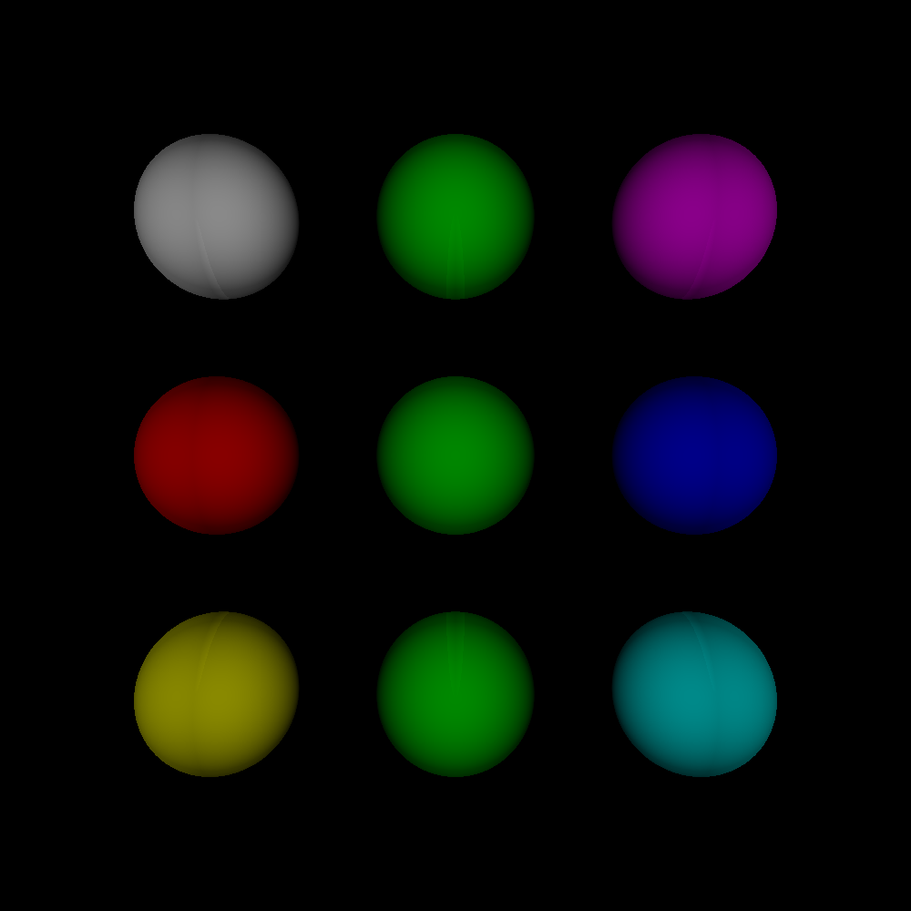
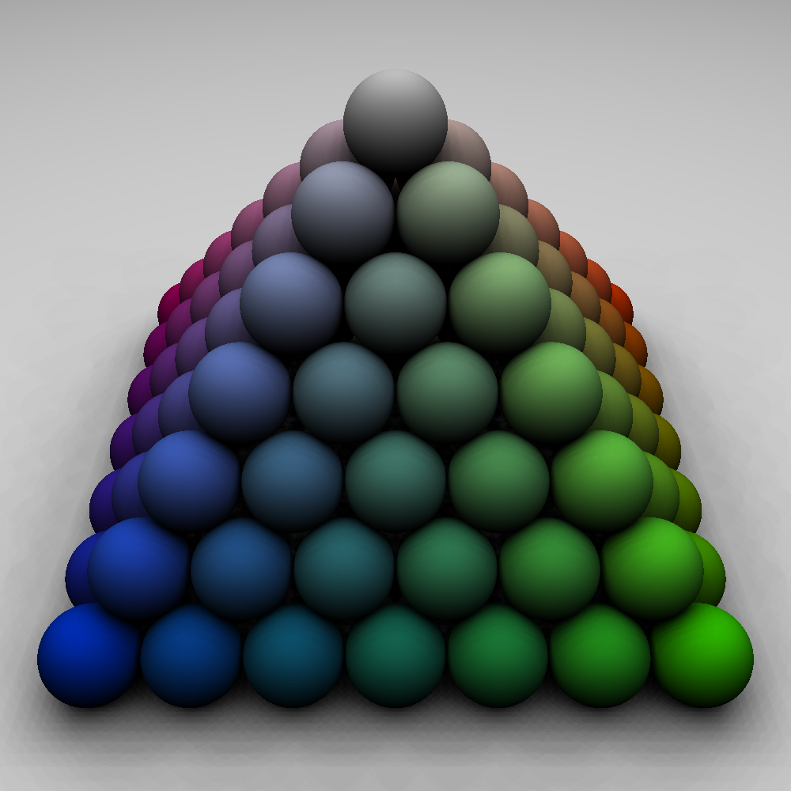
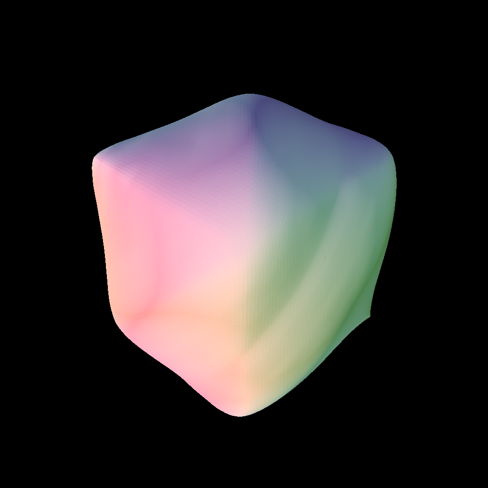

<!-- 
<style>
/* General styles for all headers */
h1, h2, h3, h4, h5, h6 {
    font-family: 'Arial', sans-serif; /* Change font family as needed */
    color: #333; /* Dark gray color for better readability */
    margin: 0.5em 0; /* Margin for spacing */
    border: none;
}

/* Specific styles for each header level */
h1 {
    font-size: 2.5em; /* Larger size for main headers */
    border-bottom: 2px solid #ccc; /* Underline for emphasis */
}

h2 {
    font-size: 2em; /* Medium size for sub-headers */
    color: #555; /* Slightly lighter gray */
}

h3 {
    font-size: 1.5em; /* Smaller size for sub-sub-headers */
    color: #777; /* Even lighter gray */
}

h4 {
    font-size: 1.2em;
    font-weight: bold; /* Make it bold for emphasis */
}

h5, h6 {
    font-size: 1em; /* Smallest size for minor headers */
    font-style: italic; /* Italics for differentiation */
}
</style>
 -->

<h2>compile command</h2>

run this command on the project directory. the compiled code and result will be in the out directory.

```console
nvcc -O3 -o out/cuda source/main.cu `pkg-config --cflags --libs opencv4` --disable-warnings
```

<h3>run on CPU</h3>

```console
./cuda --scene mesh.scene --obj subdiv.obj
```

<h3>run on CUDA</h3>

```console
./cuda --scene mesh.scene --obj subdiv.obj --cuda
```


<h2>command line arguments</h2>

```
--scene <string:scene_file_name>
--obj <string:obj_file_name> [optional] 
--out <string:out_file_name> [optional] [default: "output.bmp"]
--threads <int:number_of_threads> [optional] [default: <all_cores_available>]
--width <int:width_of_image> [optional] [default: 1000]
--height <int:height_of_image> [optional] [default: 1000]
--shadow <bool:true|false> [optional] [default: false]
--cuda [optional] [default: false]
```

----------

<h2>CUDA Speed Up</h2>

<h3>mesh 1000x1000</h3>

```console
CPU (Multithread): 36.255803 seconds
CUDA: 0.411442 seconds
speed up: x88.2
```

<h3>mesh 5000x5000</h3>

```console
CPU (SingleCore, Intel(R) Xeon(R) Gold 5218R): -
CPU (MultiThread, Intel(R) Xeon(R) Gold 5218R): 535.287 seconds
CUDA (RTX A5500): 6.625 seconds
speed up: x80.8
```

<h3>Spheramid 10000x10000 </h3>

```console
CPU (MultiThread, Intel(R) Xeon(R) Gold 5218R): 5.394 seconds
CUDA (RTX A5500): 0.742 seconds
spped up: x7.26
```

----------


<h1>output exmaple</h1>

> basic


> spheramid


> mesh

